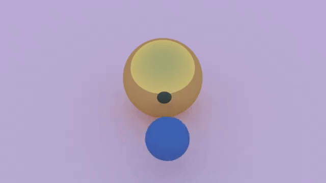
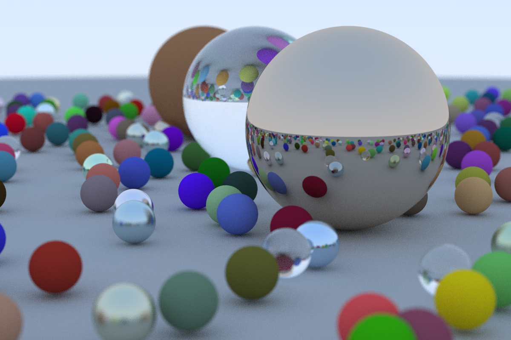

# rusty-rays
A simple ray tracer written in rust

Inspired by [Ray Tracing in One Weekend](https://raytracing.github.io/books/RayTracingInOneWeekend.html).

## Usage
```
cargo run scene.json
```

See `examples` for the scene json description.

Run `cargo run --help` to see all options, including multithreading.

## Screenshots

### Video rendering


### Cover art (from Ray Tracing in One Weekend)

